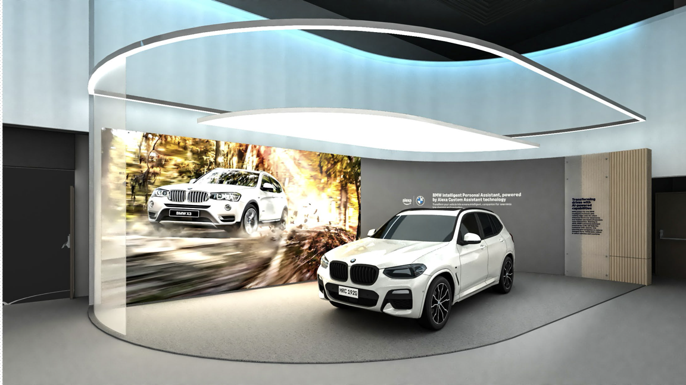

Amazon Smart Vehicles - Alexa Custom Assistant (ACA) + BMW
###########

.. note::
    This vignette will be staffed by Product Specialists who will interact with attendees. The information below is just informational and does not replace 

⭐ BMW Custom Assistant (BCA/ACA)
**********

Alexa Custom Assistant (ACA) enables device makers and service providers to create intelligent assistants tailored to their brand personality and customer needs. ACA enables auto manufacturers, like BMW, to provide customers with the next generation of ambient experiences. BMW customers can ask the BMW Custom Assistant (BCA) for information about the vehicle, control music and other media, help with navigation

* [insert bulleted product details]
* [insert bulleted product details]

------------

BMW X3
**********

🌐 `Product Webpage <https://www.bmwusa.com/vehicles/x-series/x3/bmw-x3.html>`_

**Details** 

* Transforming Drives with AI-Powered Capabilities
*  BMW powers its new BMW Intelligent Personal Assistant with cutting-edge voice AI, which enhances the in-car experience and enables new levels of seamless voice interaction. Starting in 2025, BMW`s assistant powered by LLMs will help the customer with search, trip planning & navigation in natural dialogue form. Initial beta rollout in select vehicles and countries.
*  BMW Intelligent Personal Assistant, Powered by Alexa Custom Assistant Technology
*  Transforming your vehicle into a more intelligent companion for seamless trip planning and navigation

