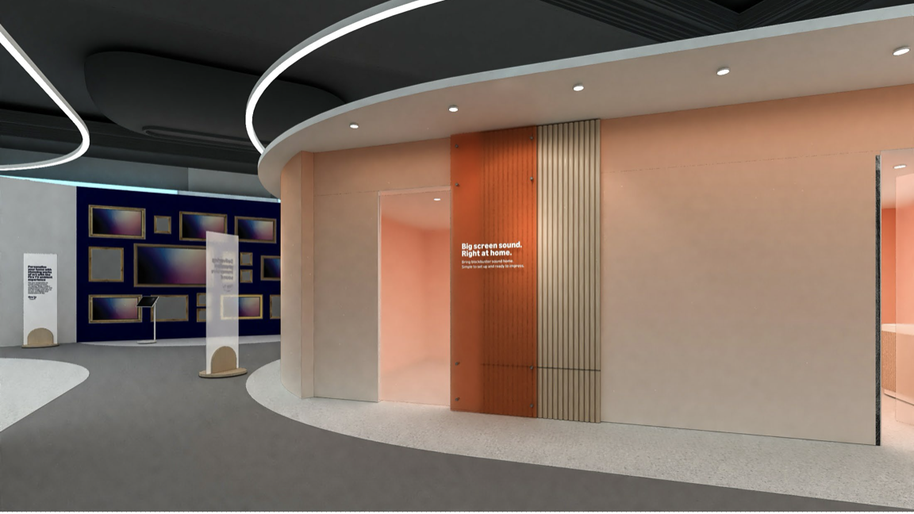
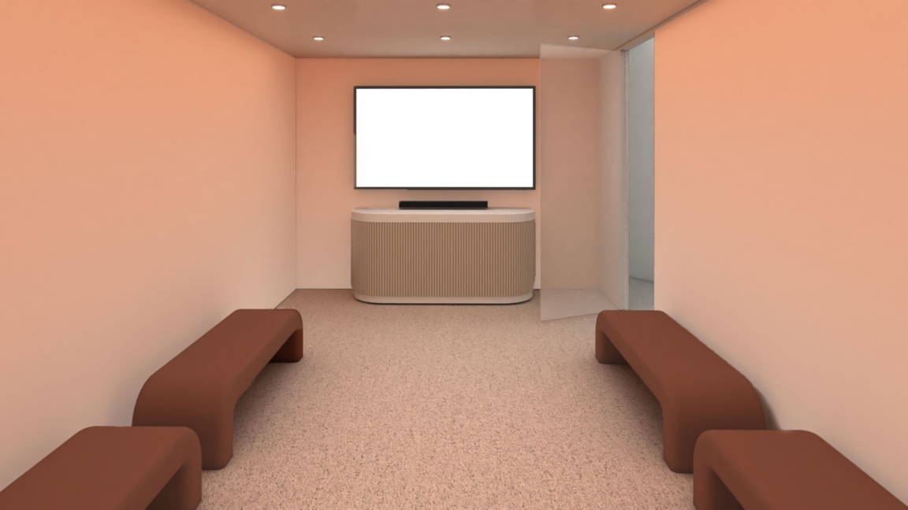

Fire TV Immersive Demo Room
###########

Demo Experience -- Dolby Atmos Content
**********

Attendees will enter the room 10-20 people at a time. Please tell them briefly about two products in the room -- the Fire TV Omni Mini-LED 85"  and the Fire TV Sound Bar Plus with Subwoofer and Surround speakers -- let the attendees know that they can leave at any time, then begin to play TV show and increase the volume. After about 1-2 mins, lower the volume and end the demo. Have the attendees exit through the door closest to the TV. 

To keep things simple, we will play the TV show **Fallout** on Prime Video. If you find scenes that have a lot of action and really show off the audio, feel free to continue to play it.

⭐ Fire TV Omni Mini-LED 85" 
**********

https://www.amazon.com/dp/B0C7S8Z4C1

**Details**

Experience a new dimension of home entertainment with Amazon's Omni Mini-LED Series. This cutting-edge TV seamlessly blends into your daily life, offering stunning 4K QLED visuals with over a billion lifelike colors and 1,344 dimming zones for unparalleled contrast. The intelligent picture technology adapts to your environment, ensuring optimal viewing in any light. Immerse yourself in crystal-clear Dolby Atmos audio that brings every scene to life. For gaming enthusiasts, the 144Hz refresh rate with AMD FreeSync Premium Pro certification delivers fluid, tear-free action. With hands-free Alexa control, accessing your favorite content becomes effortless. This TV doesn't just display; it transforms your living space into a dynamic, responsive entertainment hub.

* Amazon's best picture quality. Plus, innovative smart features, stunning artwork, seamless gaming and Dolby Atmos audio.
*  Enjoy stunning detail on a 4K QLED mini-LED display, over a billion lifelike colors, Dolby Vision IQ, HDR10+ Adaptive, and up to 1,400 nits of peak brightness.
*  With 1344 dimming zones, the Omni Mini-LED Series delivers higher, more captivating contrast. Denser dimming zones provide depth and detail, even in the smallest areas of your screen.
*  Fire TV Intelligent Picture uses a powerful processor to automatically fine-tune what's playing, scene-to-scene. It also adapts to your room's current light and color.
*  Lightning-fast gaming with 144Hz that has been AMD FreeSync Premium Pro-certified. Amazon's best TV for gaming provides the most seamless transitions, tear-free visuals, and fluid motion during intense gameplay.
*  Hear your favorites come to life with 2.1 Dolby Atmos audio. Experience crystal clear dialog and dramatic bass that envelops you in the scene.
*  Put the remote down and control your TV hands-free with Alexa. Just ask Alexa to turn on the TV, find, launch, and control content.

------------

⭐ Fire TV Sound Bar Plus with Subwoofer and Surrounds 
**********

https://www.amazon.com/dp/B0CXZHM5Q8

**Details**

Immerse yourself in a cinematic audio experience with the Fire TV 5.1 Surround Sound system, designed to transform your living room into a personal theater. This comprehensive setup, featuring a soundbar, subwoofer, and two surround speakers, creates a multi-dimensional soundscape that brings your favorite content to life. Dolby Atmos and DTS:X technologies ensure every whisper and explosion is heard with stunning clarity, while the dedicated center channel sharpens dialogue for crystal-clear conversations. Effortlessly adapt to various entertainment modes, from action-packed movies to late-night viewing. With seamless Fire TV integration, controlling your audio environment becomes second nature, allowing you to tailor your sonic experience to perfectly complement your daily entertainment rituals.

* Get the full cinematic experience with 5.1 surround sound. Featuring crisp dialogue, Dolby Atmos, and DTS:X.
*  Add a subwoofer and two surround speakers for an audio experience that feels just like being at the big screen.
*  A dedicated center dialogue channel sharpens conversations so you can catch every moment of your favorite shows.
*  Dolby Atmos features 3D sound that moves around you and clear dialogue. DTS:X delivers multi-dimensional audio for lifelike sound.
*  After you plug in your subwoofer and speakers to power, they connect to your soundbar for total surround sound.
*  Movie, Music, Sports, and Night modes optimize audio based on what you’re watching.
*  Use one remote to control your TV and soundbar. And customize your sound in the Fire TV audio settings (select models apply).

