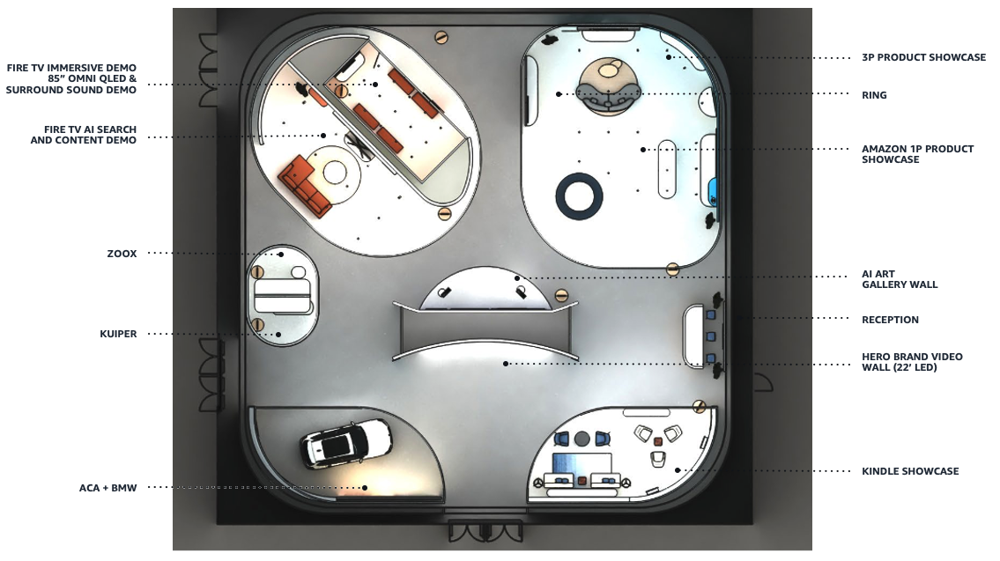

Amazon Devices & Services Exhibit 2025
###########

Amazon's showcase at CES 2025 demonstrates a comprehensive integration of smart technology into everyday life. The exhibit features a connected apartment vignette, showcasing how Amazon's devices work in harmony with other brands to create an effortless living experience. Highlights include the new Kindle Colorsoft with vibrant color display, Fire TV's innovative features and Ambient Experience, and a premium sound experience zone. The showcase also presents Zoox, Amazon's purpose-built robotaxi, and Project Kuiper, aimed at extending global internet connectivity.

The exhibition further emphasizes Amazon's role in automotive innovation, featuring the BMW Intelligent Personal Assistant powered by Alexa Custom Assistant Technology. This AI-powered system enhances the in-car experience with natural dialogue interactions for search, trip planning, and navigation. Amazon's overall message at CES 2025 is clear: their technology is designed to seamlessly integrate into daily routines, simplifying tasks, sparking creativity, and bringing people closer together, all while remaining unobtrusive in users' lives.

Vignettes
--------

.. toctree::
   :maxdepth: 1
   
   kindle_showcase
   amazon_1p_product_showcase
   3p_partner_product_showcase
   fire_tv_ai_art_gallery_wall
   fire_tv_immersive_demo_room
   fire_tv_ai-powered_search_and_content
   zoox
   project_kuiper
   amazon_smart_vehicles

..
  A useful guide for syntax and formatting: https://sublime-and-sphinx-guide.readthedocs.io/en/latest/index.html
  RTD Project: https://readthedocs.org/projects/d1hl-rtd/
  RTD Page: https://d1hl-rtd.readthedocs.io/
  Github: https://github.com/travisoo-amzn/D1HL-RTD/ 
