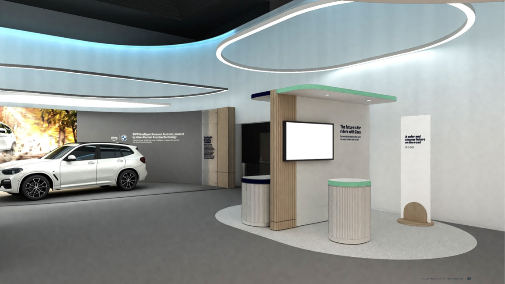

Zoox
###########

⭐ Zoox Robotaxi
**********

🌐 `Webpage <https://www.zoox.com/vehicle>`_

Experience a new era of urban mobility with Zoox, a revolutionary autonomous vehicle designed to seamlessly integrate into your daily life. This innovative ride-hailing solution offers a spacious, symmetrical cabin where every seat provides equal comfort and access to personalized controls. Enjoy wireless charging and a versatile interior that adapts to your needs, whether you're working or relaxing. The compact design with four-wheel steering navigates city streets effortlessly, while over 100 safety innovations ensure peace of mind. With a powerful battery for all-day operation and advanced communication systems, Zoox interacts smoothly with its environment. From curbside pick-ups to adaptive lighting, every detail is crafted to enhance your journey, transforming everyday transportation into a seamless, enjoyable experience.

**Details**

* Reinventing personal transportation for a safer, cleaner, and more enjoyable future
*  On-demand autonomous ride-hailing that handles traffic while you relax
* Spacious, symmetrical cabin design offering equal comfort for all passengers
* Wireless phone charging and personalized ride controls via Rider Screen
* Versatile interior space for work or entertainment during your journey
*  Compact size with four-wheel steering for easy urban navigation
*  Over 100 safety innovations, including unique airbag designs
* Communicates with other road users through advanced light and sound signals
*  133 kWh battery for all-day operation without recharging
*  Seamless curbside pick-ups and drop-offs in busy city environments
*  Integrated design focusing on redundancy and reliability
*  Adaptive lighting system to indicate vehicle intentions to pedestrians and drivers

Zoox Robotaxi in Las Vegas
**********

🌐 `Robotaxi in Las Vegas <https://zoox.com/journal/las-vegas/>`_

**Details**

Zoox has expanded its autonomous vehicle operations to Las Vegas, marking the first time a fully driverless, purpose-built robotaxi is operating on public roads in Nevada.

**Key Developments:**

* Deployment in Las Vegas: Since June 2023, Zoox's robotaxi has been navigating public roads in Las Vegas without a driver, steering wheel, or pedals. 
* Operational Geofence Expansion: Testing began around Zoox's Las Vegas headquarters and has now extended to include the Las Vegas Strip and surrounding areas. The Strip presents complex driving scenarios, such as multiple lanes, high speeds, heavy pedestrian traffic, and large intersections.
* Testing and Rider Programs: Currently, rides are available to Zoox employees, with plans to include employees' families and friends soon. In early 2025, the "Zoox Explorers" program will offer external riders the opportunity to experience the service at no charge.
* Infrastructure and Team Growth: Since arriving in Las Vegas in 2019, Zoox has expanded its facilities, including a 190,000-square-foot warehouse for vehicles and additional office space. The company continues to grow its team to support operations, maintenance, and rider services.
* Future Goals: Zoox aims to provide driverless rides to the Las Vegas public in the short term.
The ultimate objective is to enhance urban safety, cleanliness, and enjoyment through autonomous transportation.
These advancements in Las Vegas are integral to Zoox's mission to reinvent transportation and prepare for a commercial launch in 2025.

Zoox Robotaxi in San Francisco
**********

🌐 `Robotaxi in San Francisco <https://zoox.com/journal/zoox-robotaxi-in-san-francisco>`_

**Details**

Zoox has expanded its autonomous ride-hailing operations to San Francisco, marking its third city deployment after Foster City and Las Vegas. 

**Key Developments:**

* San Francisco Deployment: Zoox's purpose-built robotaxi, devoid of traditional manual controls, is now operating on San Francisco streets. Initial testing is focused in the SoMa neighborhood, with rides currently available to Zoox employees. Plans are in place to expand the operational area to additional neighborhoods as testing progresses.
* Technological Validation: The deployment follows over seven years of rigorous testing and validation of Zoox's AI stack across multiple cities. The robotaxi leverages a deep understanding of San Francisco's complex urban environment.
* Community Engagement: Zoox has been actively engaging with the San Francisco community through events to familiarize residents with the robotaxi. The company encourages public interaction to ensure the community feels informed and comfortable with the new technology.
* Las Vegas Expansion: Concurrently, Zoox has expanded its operational area in Las Vegas to include The Strip and surrounding regions. This area presents complex driving scenarios, providing valuable data to enhance the AI system.
* Early Rider Program: Zoox plans to launch an early rider program in Las Vegas in 2025, offering select riders free access to the service in exchange for feedback. Interested individuals are encouraged to sign up for updates to participate in the program. These developments signify significant progress toward Zoox's goal of launching a fully autonomous ride-hailing service, aiming to enhance urban mobility and safety.
